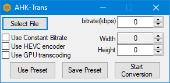

# Transcoder
Custom transcoder based of [FFMPEG](https://ffmpeg.org/) written in
[node.js](https://nodejs.org/en/)(Back-End) and [AutoHotkey](https://www.autohotkey.com/)(Front-End)

# Installation
## Installing
### Downloaded sourcecode
1. Download [node.js](https://nodejs.org/en/) and [AutoHotkey](https://www.autohotkey.com/)
2. Click download this github repo
3. Run main.ahk

### Downloaded release
1. Download [node.js](https://nodejs.org/en/)
2. Download the latest stable release
3. Run main.exe

# Troubleshooting
1. If there is any problem, copy the error that you got
3. copy that and make a new [issue](https://github.com/MierenManz/transcoder/issues/new)
4. Paste the copied error in the issue and then submit it.
5. Wait a few days and a new version will be released

# Notes
- Currently you need to download both [node.js](https://nodejs.org/en/) and [AutoHotkey](https://www.autohotkey.com/) for running the sourcecode!
- HW Accel is supported, but only on hardware that supports, AMF or NVENC/CUVID (I WILL NOT ADD QUICKSYNCVIDEO ENCODING OR DECODING)

# Known Bugs
- NONE! :D

# Next Updates
- Less clutter
- User requested features

# Changelog
## v1.7.1
- Removed annoying message boxes

## v1.7.0
- Added auto updates, When a new version is available it will give you a window that asks if you want to update or not
- Added a small tooltip at the cursor when the render is finished.
- Updated the rendering window so you can drag it now.
- Updated FFMPEG and FFPROBE for the latest features.
- Rewrote a few lines of code so that it is less cluttered.
- Fixed a bug where the main menu would error out when you did not select a preset!

## v1.6.1
- Added presets, You can now make and use presets.
- Changed the close window in the rendering GUI. It will no longer let you wait for it to finish, it will stop the render and delete the file.
- Updated ffmpeg and ffprobe for the latest features.
- Fixed the program not exiting when the gui is destroyed.
- Fixed a bug where you could not scale the output of the video if you used cpu rendering.

## v1.6.0
- Added size changing, you can now downscale(or upscale) videos (intel gpu transcoding not supported!)
- Fixed typo's
- Changed ui
- Added a autoscale feature

## v1.5.2
- Fixed a Small visual bug in the percentage window when clicking "Close Window" while transcoding is not finished yet 

## v1.5.1
- Removed unused files
- Fixed a bug where you could not select files where the filename had a space in it
- Added check for input file(so that ffmpeg does not error out)

## v1.5.0
- Rewrote communication code(yes, again) That will most likely fix issues that were there in v1.2.0 - v1.4.0
- Removed dependency on [ini](https://www.npmjs.com/package/ini) and made my own config parser
- Removed unused files e.g. scripts to test stuff and deprecated stuff

## v1.4.0
- Rewrote communication code(again) so now it should be reliable and even a little faster
- Removed some code for faster execution

## v1.3.0
- Rewrote communication code(again) for faster communication between Front-End and Back-End
- Added support for AMD gpu encoding (I hope)

## v1.2.5
- Started on another rewrite to allow for faster and cleaner communications between front-end and back-end

## v1.2.0
- Rewrote most of the code for communication between Front-End and Back-End

## v1.1.0
- Changed directory structure for a more organized environment

## v1.0.0
- Fixing bugs in Dev build v3 and v4

## Dev build v4
- Making the front-end
- Rewriting back-end for a more optimized approach for formatting inputs

## Dev build v3
- Fixing bugs in Dev build v1 and v2
- Learning how to pass inputs from the front-end to back-end

## Dev build v2
- Building transcoder interface

## Dev build v1
- Getting metadata and formatting inputs
